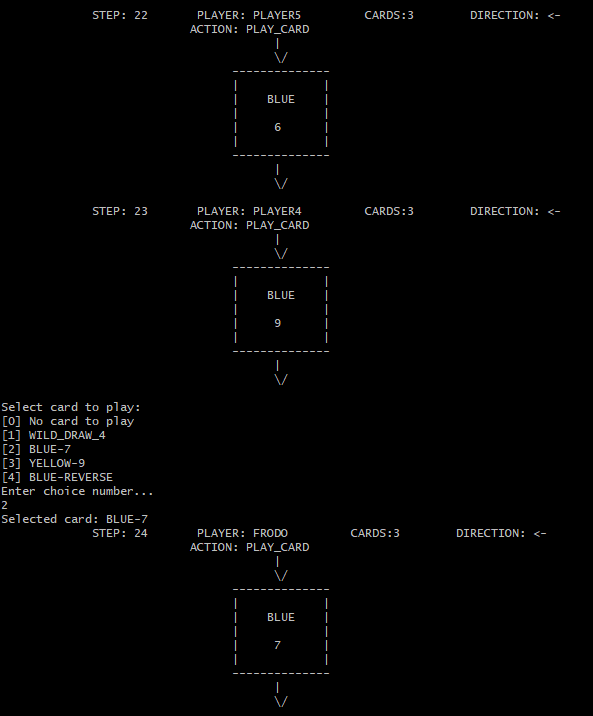

## uno-game


```groovy
                                 ____ ___        ________
                                |    |   \ ____  \_____  \
                                |    |   //    \  /   |   \
                                |    |  /|   |  \/    |    \
                                |______/ |___|  /\_______  /
                                              \/         \/

```

The game developed just for fun without looking to any already existing implementations.

A single player can play with 1-9 bots, or 2-10 bot players can play themselves.

There is a basic bot behavior implemented with a simple choose-cart strategy, which might be improved or worsened,
implementing corresponding interfaces and extending/adjusting the basic behavior.

### Rules

The rules are based on [Official Rules](https://en.wikipedia.org/wiki/Uno_(card_game)),
but without points counting and multiple iterations*.

- _*_ also, _Wild Draw Four_ card can be played without any restrictions and penalties, (but bots play it fairly when no such color or any other options).

### Start the Game

_Java 17+_ is required.

```bash
java -jar uno-game-1.0-SNAPSHOT-jar-with-dependencies.jar
```

### Game Process

- Enter your name and use follow instructions for choose card or color.
- Press `ENTER`/`RETURN` to move forward.
- Append your input with `+U` to say __UNO!__
- Enter an empty name to skip the game if you like the bots play alone.



### Build with Unit and Integration Tests

```bash
./mvnw clean verify
```

### Build (skip tests)

```bash
./mvnw clean package -DskipTests
```

### Unit Tests Coverage

See `target/jacoco-ut/index.html` report.